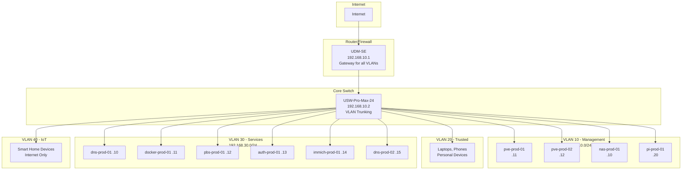

## Network Topology



## VLAN Design

<Note>
VLAN 1 (default untagged) is intentionally NOT used as the management VLAN. A dedicated VLAN ID is assigned to management to avoid devices landing on it accidentally.
</Note>

### VLAN Summary

| VLAN ID | Name | Subnet | Purpose |
|---------|------|--------|----------|
| 10 | Management | 192.168.10.0/24 | Infrastructure devices only (Proxmox, NAS, switches) |
| 20 | Trusted | 192.168.20.0/24 | Personal devices (laptops, phones, tablets) |
| 30 | Services | 192.168.30.0/24 | All v3 VMs and LXCs |
| 40 | IoT | 192.168.40.0/24 | Smart home devices (internet-only, isolated) |

### VLAN 10 — Management (192.168.10.0/24)

**Purpose**: Strict access. Management devices only. Infrastructure administration.

**Members**:
- Proxmox hosts (pve-prod-01, pve-prod-02)
- NAS management interface (nas-prod-01)
- Network equipment (UDM-SE, UniFi switch)
- Raspberry Pi (QDevice, monitoring)

### VLAN 20 — Trusted (192.168.20.0/24)

**Purpose**: Personal trusted devices.

**Members**:
- Laptops, phones, tablets
- v2 services during migration (remain untouched until cutover)

<Note>
v2 services currently live on 192.168.20.0. They stay here during v3 build. During Phase 4 migration, AdGuard DNS rewrites flip per-service from v2 IPs to v3 IPs on VLAN 30. No big-bang cutover.
</Note>

### VLAN 30 — Services (192.168.30.0/24)

**Purpose**: All v3 VMs and LXCs. Production services.

**Members**:
- All VMs: docker-prod-01, auth-prod-01, immich-prod-01, pbs-prod-01
- All LXCs: dns-prod-01, dns-prod-02
- Future k3s nodes (192.168.30.100+)

<Warning>
Containers inside VMs do NOT get individual VLAN IPs. They share the host VM's IP and are accessed via Traefik reverse proxy on the VM's IP.
</Warning>

### VLAN 40 — IoT (192.168.40.0/24)

**Purpose**: Fully isolated smart home devices. Internet access only. No inter-VLAN routing.

**Members**:
- Smart home devices, printers, cameras, anything untrusted
- 7 existing IoT devices migrated from 192.168.30.0 during Phase 1

---

## IP Address Plan

### VLAN 10 — Management (192.168.10.0/24)

| Device | IP | Notes |
|--------|----|-----------|
| UDM-SE | 192.168.10.1 | Gateway (already configured, do not change) |
| Core Switch (UniFi) | 192.168.10.2 | Management interface |
| UPS (if networked) | 192.168.10.3 | Reserved — NUT uses USB for now |
| nas-prod-01 | 192.168.10.10 | Unraid management/NFS interface |
| pve-prod-01 | 192.168.10.11 | MS-A2 Proxmox management UI |
| pve-prod-02 | 192.168.10.12 | Optiplex Proxmox management UI |
| pi-prod-01 | 192.168.10.20 | QDevice + monitoring |
| 192.168.10.30–.49 | — | Reserved future expansion / IPMI / OOB |
| 192.168.10.100+ | — | DHCP pool if needed |

### VLAN 20 — Trusted (192.168.20.0/24)

Unchanged from v2. Personal laptops, phones, trusted devices. v2 services (Proxmox at .2, docker host at .10) remain here during the v3 build and migration. Decommissioned v2 IPs freed up once Phase 4 cutover is complete.

### VLAN 30 — Services (192.168.30.0/24)

All v3 VMs and LXCs.

| Device | IP | Notes |
|--------|----|-----------|
| dns-prod-01 | 192.168.30.10 | Primary AdGuard Home (LXC on pve-prod-01) |
| docker-prod-01 | 192.168.30.11 | Media stack VM — all containers behind Traefik |
| pbs-prod-01 | 192.168.30.12 | Proxmox Backup Server (VM on pve-prod-02) |
| auth-prod-01 | 192.168.30.13 | Authentik IdP (dedicated VM on pve-prod-01) |
| immich-prod-01 | 192.168.30.14 | Immich photos (dedicated VM on pve-prod-01) |
| dns-prod-02 | 192.168.30.15 | Secondary AdGuard Home (LXC on pve-prod-02) |
| 192.168.30.100+ | — | DHCP / sandbox / test / future k3s nodes |

### VLAN 40 — IoT (192.168.40.0/24)

7 existing IoT devices migrate from 192.168.30.0 during Phase 1. Internet access only. No inter-VLAN routing.

- Gateway: 192.168.40.1
- DHCP pool: 192.168.40.100+

---

## Firewall Rules

Rules enforced at UDM-SE. **Default policy is DENY ALL inter-VLAN**. Explicit ALLOW rules only.

| Source | Destination | Port / Protocol | Action | Reason |
|--------|-------------|-----------------|--------|--------|
| Trusted (20) | Services (30) | Any | ALLOW | Users reach internal services |
| Trusted (20) | Management (10) | TCP 8006, 22, 443 | ALLOW | Admin access to Proxmox, SSH, NAS UI |
| Services (30) | Services (30) | Any | ALLOW | Inter-service communication |
| Services (30) | Trusted (20) | Any | DENY | Services cannot initiate to user devices |
| Services (30) | Management (10) | Any | DENY | Services cannot touch infra management |
| IoT (40) | Any internal | Any | DENY | IoT fully isolated from all internal VLANs |
| Any | Internet | Any | ALLOW | All VLANs can reach WAN unless blocked |

<Warning>
**Security by Default**: Services VLAN cannot initiate connections to Management VLAN. This prevents compromised VMs from attacking infrastructure.
</Warning>

---

## DNS Architecture

### Split-Horizon DNS

**Internal DNS**: AdGuard Home handles DNS rewrites for `*.giohosted.com` → internal Traefik IP

**External DNS**: Cloudflare manages public DNS — CNAMEs point to Cloudflare Tunnel

**Result**: Same FQDN works internally and externally with valid TLS certificates

### AdGuard Home Configuration

**Primary Instance**: `dns-prod-01` (LXC on pve-prod-01, 192.168.30.10)
- Receives all client DNS queries (configured as primary DNS in UDM-SE DHCP)
- Handles ad-blocking, DNS rewrites, upstream forwarding

**Secondary Instance**: `dns-prod-02` (LXC on pve-prod-02, 192.168.30.15)
- Synced from dns-prod-01 via `adguardhome-sync` container
- Configured as secondary DNS in UDM-SE DHCP
- DNS survives either Proxmox node going down

### DNS Rewrites (Internal Access)

AdGuard rewrites `*.giohosted.com` to internal Traefik IP:

```
*.giohosted.com → 192.168.30.11 (docker-prod-01 Traefik)
```

Services accessible internally:
- `audiobooks.giohosted.com` → Audiobookshelf
- `books.giohosted.com` → Shelfmark  
- `request.giohosted.com` → Seerr
- `auth.giohosted.com` → Authentik
- `immich.giohosted.com` → Immich
- etc.

### Upstream DNS Resolvers

AdGuard forwards to:
1. Cloudflare DNS (1.1.1.1, 1.0.0.1) — primary
2. Google DNS (8.8.8.8, 8.8.4.4) — fallback

---

## Reverse Proxy — Traefik

**Platform**: Traefik v2 (replaces Nginx Proxy Manager from v2)

**Deployment**: Container on docker-prod-01 VM

**Why Traefik?**
- k3s ingress alignment — Traefik is default k3s ingress controller
- Docker label-based routing — no separate config files per service
- Wildcard certificate via Cloudflare DNS-01 challenge

### TLS Configuration

**Wildcard Certificate**: `*.giohosted.com` via Cloudflare DNS-01 challenge
- One cert covers all internal services
- Automatic renewal via Traefik + Cloudflare API token
- Valid TLS for internal access (no browser warnings)

### Routing Method

Docker label-based routing. Example:

```yaml
services:
  sonarr:
    image: linuxserver/sonarr
    labels:
      - "traefik.enable=true"
      - "traefik.http.routers.sonarr.rule=Host(`sonarr.giohosted.com`)"
      - "traefik.http.routers.sonarr.tls=true"
      - "traefik.http.services.sonarr.loadbalancer.server.port=8989"
```

<Note>
NPM (Nginx Proxy Manager) kept running in parallel during migration until all services confirmed working behind Traefik. Cutover is a flip of the AdGuard DNS rewrite target IP, making rollback instant.
</Note>

---

## External Access

### Cloudflare Tunnel

**Deployment**: `cloudflared` container on docker-prod-01

**Exposed Services**:
- `audiobooks.giohosted.com` → Audiobookshelf (via Cloudflare Access + Authentik OIDC)
- `books.giohosted.com` → Shelfmark (via Cloudflare Access + Authentik OIDC)
- `request.giohosted.com` → Seerr (via Cloudflare Access)
- `auth.giohosted.com` → Authentik (tunnel only, NOT behind Cloudflare Access)

**Why Cloudflare Tunnel?**
- No port forwarding required on router
- Free tier supports multiple services
- Cloudflare Access provides additional authentication layer
- DDoS protection included

### Plex — Direct Port Forward

**Configuration**: Port 32400 forwarded on UDM-SE → nas-prod-01 (192.168.10.10)

**Why NOT Cloudflare Tunnel for Plex?**
- Cloudflare ToS prohibits video streaming through tunnels
- Plex handles its own TLS and relay natively
- Direct port forward is simple, proven, and performant
- One open port for a well-maintained application is acceptable risk

<Warning>
Pangolin (VPS relay) was evaluated and rejected. VPS relay adds latency for Plex streaming. Cloudflare Tunnel is free and works for non-streaming services. No meaningful reason to add VPS cost.
</Warning>

### WireGuard VPN

**Deployment**: Native on UDM-SE

**Purpose**: Secure remote LAN access for administration

**Configuration**: Carried forward from v2 as-is

---

## Network Hardware

| Device | Model | Role | IP |
|--------|-------|------|----|
| Router/Firewall | UniFi Dream Machine SE (UDM-SE) | Primary router, firewall, VLAN gateway | 192.168.10.1 |
| Switch | UniFi USW-Pro-Max-24 | Managed 2.5GbE switch, VLAN trunking | 192.168.10.2 |
| Storage Link | 10GbE SFP+ DAC (MS-A2 ↔ NAS) | Dedicated storage traffic, not on LAN switch | — |

### 10GbE Storage Network

**Dedicated Link**: MS-A2 SFP+ Port 2 ↔ NAS X710 Port 1 (2M DAC cable)

**Purpose**: Keeps NFS storage traffic off the LAN switch. Full 10GbE bandwidth for VM/container NFS mounts.

**Configuration**: Separate subnet (not on any VLAN). Point-to-point link.

---

## Migration Strategy

v2 and v3 networks run in parallel during migration:

1. **Phase 1**: Build VLANs, configure firewall rules, validate connectivity
2. **Phase 2-3**: Build v3 infrastructure on Services VLAN 30
3. **Phase 4**: Per-service cutover via AdGuard DNS rewrite flips
   - v2 service: `sonarr.giohosted.com → 192.168.20.10` (v2 docker host)
   - Flip rewrite: `sonarr.giohosted.com → 192.168.30.11` (v3 docker-prod-01)
   - Instant rollback by reversing DNS rewrite
4. **Phase 5**: Decommission v2 infrastructure after 48-hour validation

No big-bang cutover. Gradual per-service migration with instant rollback capability.