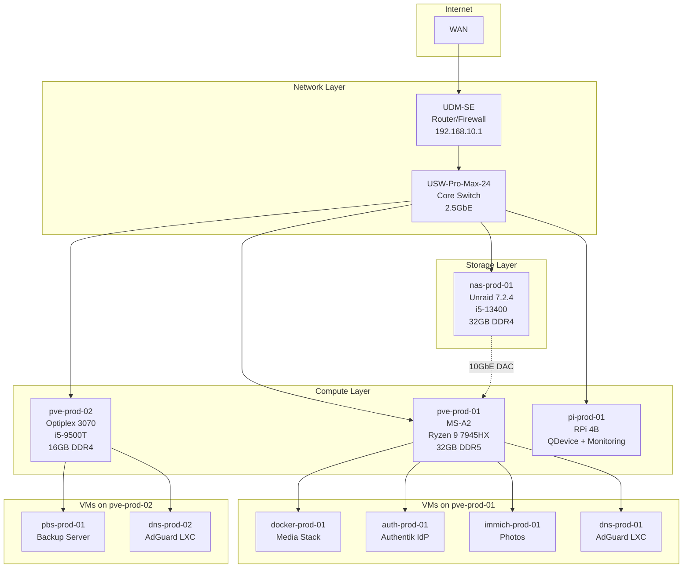

## Design Philosophy

Homelab v3 is a clean-slate rebuild with institutional knowledge from v2. Every decision is deliberate, documented, and built toward future goals (Kubernetes, GitOps, HA). Where v2 evolved organically, v3 is designed intentionally.

### Core Principles

| Principle | Applied In v2? | v3 Commitment |
|-----------|----------------|---------------|
| Bare-metal NAS separation | No (TrueNAS as VM) | Dedicated NAS host |
| Proxmox OS redundancy | No (single NVMe) | Mirrored NVMe boot |
| Proper VLAN segmentation with rules | Partial (no FW rules) | Full inter-VLAN firewall |
| UPS protection | No | Required before power-on |
| Kubernetes-ready architecture | No | Designed for future k3s |

## Infrastructure Topology

## Infrastructure Layers

### Network Layer (VLAN 10 - Management)

**UniFi Dream Machine SE** acts as the primary router, firewall, and VLAN gateway. The **USW-Pro-Max-24** provides 2.5GbE connectivity to all hosts with full VLAN trunking.

Four VLANs segregate traffic:
- **VLAN 10 (Management)**: Infrastructure devices only
- **VLAN 20 (Trusted)**: Personal devices
- **VLAN 30 (Services)**: All VMs and LXCs
- **VLAN 40 (IoT)**: Isolated smart devices, internet-only

### Compute Layer

**Primary Node (pve-prod-01)**: Minisforum MS-A2 with Ryzen 9 7945HX (16C/32T) and 32GB DDR5 runs all production workloads:
- `docker-prod-01`: Media automation stack (ARR, Plex clients, books)
- `auth-prod-01`: Authentik identity provider (dedicated VM)
- `immich-prod-01`: Photo management with ML worker (dedicated VM)
- `dns-prod-01`: Primary AdGuard Home (LXC)

**Secondary Node (pve-prod-02)**: Dell Optiplex 3070 Micro handles:
- `pbs-prod-01`: Proxmox Backup Server
- `dns-prod-02`: Secondary AdGuard Home (LXC)

**Cluster Architecture**: Two-node Proxmox cluster with QDevice on Raspberry Pi 4B prevents split-brain. HA is intentionally NOT enabled — clustering provides unified management UI only.

<Note>
HA requires matched hardware and 3+ node quorum to be meaningful. The Optiplex cannot absorb the MS-A2's workload, so HA would provide false security.
</Note>

### Storage Layer

**nas-prod-01** runs Unraid 7.2.4 on dedicated hardware (i5-13400, 32GB DDR4) in a 4U 12-bay chassis:

- **Parity Array**: 2x 12TB parity + 3x 12TB data (~36TB usable) for bulk media and downloads
- **ZFS Mirror Pool**: 2x 4TB mirror (~4TB usable) for precious data (photos, backups)
- **10GbE Direct Link**: DAC cable to MS-A2 for storage traffic (off LAN switch)
- **Plex Server**: Runs natively on Unraid using i5-13400 QuickSync iGPU for transcoding

### Power & Resilience

**UPS Protection**: Tripp-Lite 1500VA protects all devices. NUT (Network UPS Tools) server on nas-prod-01 orchestrates graceful shutdown:

1. Low battery detected → NUT signals all hosts
2. Proxmox VMs and LXCs shut down gracefully
3. Proxmox hosts shut down
4. Unraid shuts down last

<Warning>
UPS protection is a hard requirement. Power loss during HDD writes risks data corruption. The UPS was the first hardware purchased before any other equipment.
</Warning>

## Key Architecture Decisions

### Dedicated NAS Host

v2 ran TrueNAS as a VM — a fragile design. v3 gives the NAS dedicated bare-metal hardware with proper HBA and 10GbE connectivity.

### Mirrored Proxmox Boot

Single NVMe boot was v2's primary fragility. MS-A2 uses ZFS RAID-1 mirror on two NVMe drives — single drive failure doesn't kill the hypervisor.

### Service Isolation Strategy

- **Authentik** gets a dedicated VM (auth-prod-01) — LXC deployment is unstable per official documentation
- **Immich** gets a dedicated VM (immich-prod-01) — ML worker causes CPU spikes; isolation allows resource caps
- **Media stack** consolidates on one VM (docker-prod-01) — simpler than multi-VM Docker; will migrate selectively to k3s in Phase 6

### No Cache Pool at Launch

Downloads must write directly to the parity array to maintain hardlinks with media files. Cache involvement breaks this. Container appdata lives on VM local disks. No workload justifies cache at launch.

<Warning>
**Hardlink Rule**: Downloads and media shares MUST be on the same Unraid pool/filesystem. Never route downloads through cache — this breaks hardlinks and causes silent file duplication.
</Warning>

## Kubernetes Readiness

v3 hardware and network design intentionally leaves headroom for future Kubernetes deployment:

- Traefik familiarity translates directly to k3s ingress controller
- Resource allocation planned for k3s control plane + worker VMs
- Service isolation (Authentik, Immich) maps cleanly to k8s deployments
- ARR stack and qBittorrent intentionally stay in Docker (hardlinks and VPN killswitch don't translate to k8s)

<Note>
Phase 6 introduces k3s as an isolated sandbox cluster first. No production services migrate until the cluster is proven stable. Failure in the sandbox has zero impact on running services.
</Note>

## Access & Identity

### Internal Access

**Split-Horizon DNS**: AdGuard Home rewrites `*.giohosted.com` to internal Traefik IP. Same FQDNs work internally and externally with valid TLS.

**Reverse Proxy**: Traefik with Cloudflare DNS-01 wildcard certificate (`*.giohosted.com`) terminates TLS for all internal services. Docker label-based routing.

### External Access

- **Cloudflare Tunnel**: cloudflared container on docker-prod-01 exposes Authentik, Audiobookshelf, Shelfmark, Seerr
- **Plex Direct Port Forward**: Port 32400 forwarded to nas-prod-01 (Cloudflare ToS prohibits video streaming through tunnels)
- **WireGuard VPN**: UDM-SE endpoint for secure remote LAN access

### Identity Provider

**Authentik** provides OIDC/OAuth2 SSO for all services:
- Proxmox (both nodes)
- Audiobookshelf, Calibre-Web-Automated, Immich, Homarr, Beszel
- Cloudflare Access policies
- MFA enforced for admin accounts

## Migration Strategy

v3 runs in parallel with v2 infrastructure. No big-bang cutover:

1. v3 built on new VLANs (Services VLAN 30)
2. v2 services remain on Trusted VLAN 20 during build
3. Per-service cutover via AdGuard DNS rewrite flips
4. Instant rollback by reversing DNS rewrite
5. v2 decommissioned only after 48-hour validation

## Related Pages

- [Hardware Specifications](/architecture/hardware)
- [Network Design](/architecture/network)
- [Storage Architecture](/architecture/storage)
- [Compute & Virtualization](/architecture/compute)
- [Architecture Decisions](/architecture/decisions)